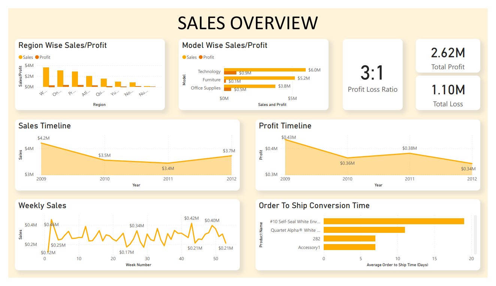
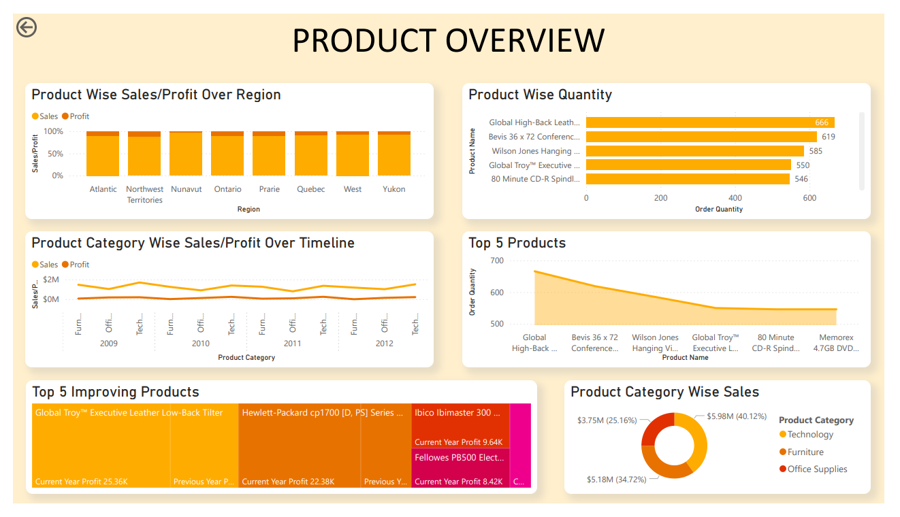
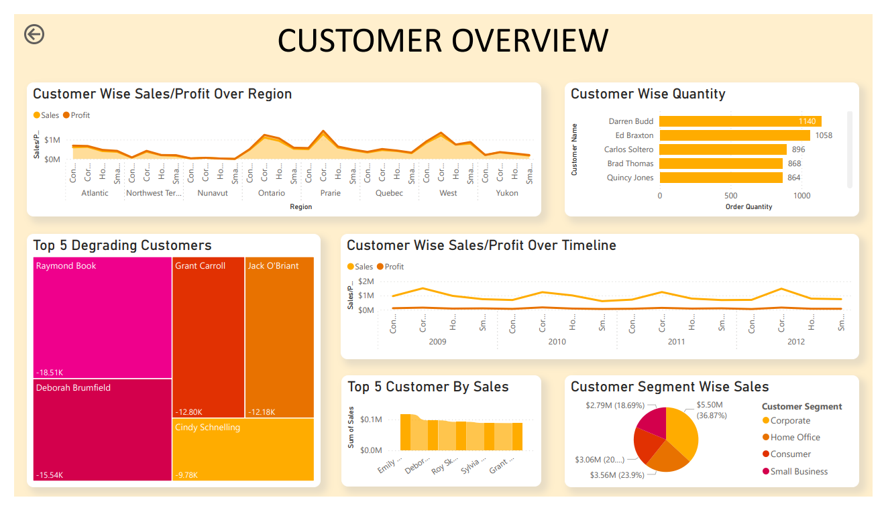

# Power BI Portfolio Projects

Welcome to my personal Power BI portfolio repository! Here you will find a collection of Power BI projects and dashboards that demonstrate my skills and expertise in data visualization, business intelligence, and analytics using Power BI.

## About Me
I am a passionate data enthusiast with a strong background in Power BI. I have extensive experience in transforming raw data into meaningful insights, creating interactive dashboards, and helping businesses make data-driven decisions. This portfolio showcases my proficiency in Power BI and highlights my ability to effectively communicate complex data visually. Visit [my linkedIn page.](https://www.linkedin.com/in/rithika-joffi-961812208/)

## Project 1: Sales Overview Dasboard

A strategic and interactive Power BI solution designed to monitor and evaluate overall sales performance. This dashboard presents KPIs such as revenue, profit margin, and sales by category and region, allowing stakeholders to assess progress against targets, identify high-performing areas, and uncover growth opportunities with clarity and precision.

## Project 2: Product Overview Dasboard

This Power BI dashboard provides insights into sales, profit, and order quantity across regions, product categories, and timelines, highlighting top-performing and improving products for data-driven decision-making.

## Project 3: Customer Overview Dasboard

This dashboard presents sales, profit, and order quantity insights using varied visualizations tailored to each data type—line charts for trends, bar charts for quantities, treemaps for performance changes, and pie charts for segment-wise sales distribution.

Thank you for visiting my Data Analysis Portfolio! I hope you find my projects informative and insightful.

